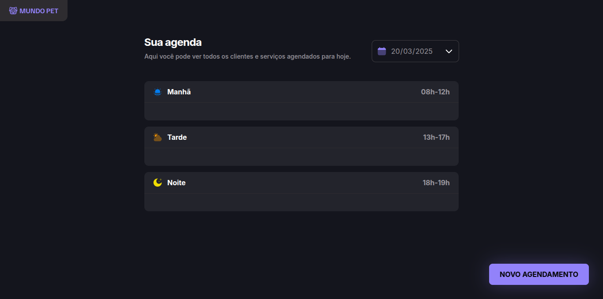

<h1 align="center">🐶 Mundo Pet 🐈‍⬛</h1>



> Formação Full-Stack: JavaScript: JavaScript Antes do Framework (Desafio prático).

O projeto é um site web responsivo de agendamento de pet shop com as funcionalidades de agendar clientes e remover o agendamento.

## 🎉 Tecnologias

- HTML e CSS
- JavaScript
- Webpack
- Babel
- Git e Github
- Json-server

## ⚙️ Executando o projeto

### Pré-requisito

- [NodeJS v20.19.0 (LTS)](https://nodejs.org/en/download)

### Passo a Passo

```
# Clone este repositório
$ git clone https://github.com/Fel1324/MundoPet.git

# Acesse a pasta do projeto no terminal/cmd
$ cd MundoPet

# Acesse o projeto no editor de código (se achar necessário)
$ code .

# Instale as dependências do projeto
$ npm install ou npm i

# Execute a API
$ npm run server
> A API irá iniciar em -> http://localhost:3001

# Abra outro terminal/cmd

# Execute o projeto
$ npm run dev
> O projeto irá iniciar em -> http://localhost:3000
```

## 💚 Contato

rafael.roberto200618@gmail.com

---

Feito com ♥ by Rocketseat :wave: [Participe da nossa comunidade!](https://discord.gg/rocketseat)